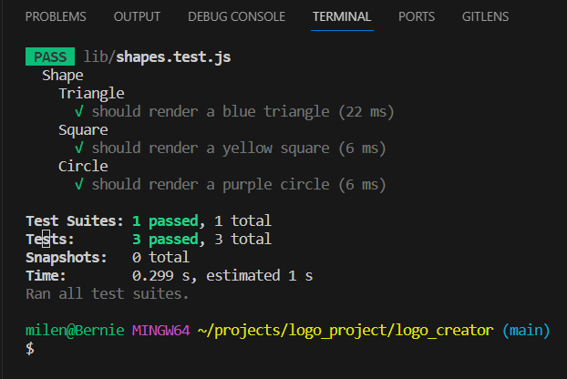

# SVG Logo Creator


## Description
As a busy student/developer, I want to be able to create a logo for my projects quickly and easily, so that I can focus on the actual project. This application allows the user to create a logo by answering a few questions in the command line, using the Inquirer NPM package. The logo is then generated as an SVG file, which can be opened in the browser. The user can choose the logo's shape, background color, text color, and text content. The logo can be used for websites, apps, and other projects.
During the making of this app I learned about SVG, which is a vector image format that can be scaled to any size without losing quality. I found it difficult to navigate the SVG documentation, but was able to find the information I needed to create a simple logo.
I also learned about the Jest testing framework, which I used to test the functions in this app. The sample code provided in the BCS acceptance criteria was very helpful in getting started with testing.
I still find it difficult to write the class constructors and methods, and I am not sure if I am doing it correctly, but I am happy that I was able to get the app to work as intended and create a logo.


## Table of Contents

- [Installation](#Installation)
- [Usage](#Usage)
- [Credits](#Credits)
- [License](#License)
- [Contributing](#Contributing)
- [Tests](#Tests)
- [Questions](#Questions)


## Installation
Clone the repo and install dependencies. To install dependencies, write the following commands in the terminal:
```npm init``` ```npm i```
Also recommended to install the [SVG Preview extension](https://marketplace.visualstudio.com/items?itemName=jock.svg) for VS Code to view the logo in the editor.

## Usage
After installing dependencies, open the index.js file in the terminal. Then run the app by writing the following command in the terminal:
```node index.js```
Then answer the questions in the command line. The logo will be generated as an SVG file. Open the SVG file in the browser to view the logo. Or, if using VS Code, install the SVG Preview extension to view the logo in the editor.
[Watch the run-through video]()

## Credits
- Inquirer NPM package documentation: 
  - https://www.npmjs.com/package/inquirer/v/8.2.4
- Jest NPM package documentation: 
  - https://www.npmjs.com/package/jest
- SVG resources and documentation:
  - https://en.wikipedia.org/wiki/SVG
  - https://www.w3schools.com/graphics/svg_intro.asp
  - https://developer.mozilla.org/en-US/docs/Web/SVG/Tutorial
  - https://developer.mozilla.org/en-US/docs/Web/SVG/Tutorial/Basic_Shapes
  - https://developer.mozilla.org/en-US/docs/Web/SVG/Tutorial/Texts
- SVG Preview extension for VS Code: 
  - https://marketplace.visualstudio.com/items?itemName=jock.svg
- Example code for testing was used from the BCS Module 10 challenge acceptance criteria which helped me get started with testing and write code for the app's functions. 
- The BCS module 9 and 10 excercises were also referenced for help with writing the class constructors, methods, and tests.
- I ended up using Chat GPT to help debug an error in the way I had constructed the class parameters for the getShape method, which was not displaying the shape color.


## License
  This project is licensed under the [MIT License](https://opensource.org/licenses/MIT)

## Contributing
Create an issue in repo: https://github.com/milena-allaway/logo_creator/issues

## Tests
Use the following command in the terminal to run tests, using Jest:
```npm test```
All tests should pass.


## Questions
For any questions or feedback, please contact me via:
- GitHub: [milena-allaway](https://github.com/milena-allaway)
- Email: [milenawheatcroft@gmail.com](mailto:milenawheatcroft@gmail.com)

***

Made with ❤️ by Milena Allaway
